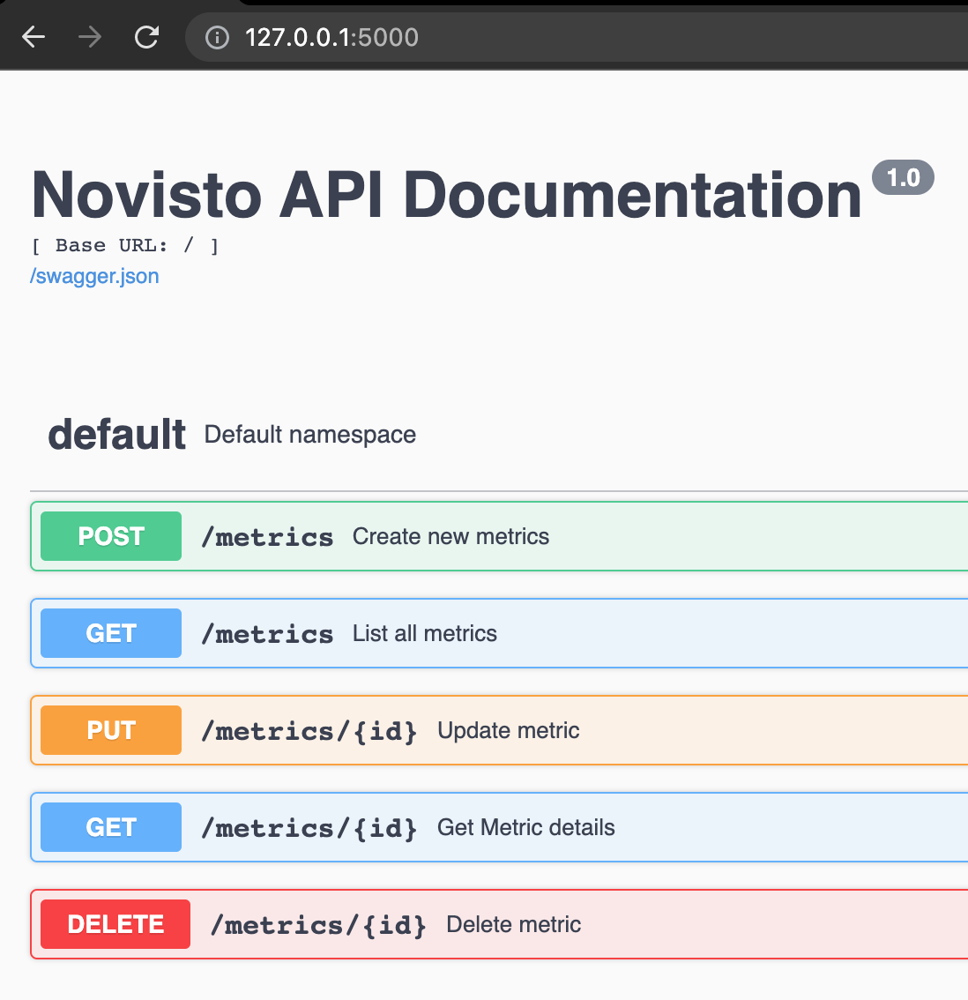

# Novisto Backend

Using Flask to build a Restful API Server with Swagger document.

Integration with Flask-restx, Flask-Migrate, and Flask-SQLalchemy extensions.

### Extension:

- Restful: [Flask-restx](https://flask-restx.readthedocs.io/en/latest/index.html)

- SQL ORM: [Flask-SQLalchemy](http://flask-sqlalchemy.pocoo.org/2.1/)

- SQL Database Management: [Flask-Migrate](https://flask-migrate.readthedocs.io/)

## Installation

Install with pip:

```
$ pip install -r requirements.txt
```

Install with pipenv:

```
$ pipenv install
```

## Database Setup

#### With SQL Query

```sqlite
create table metric
(
    id          INTEGER not null
        primary key,
    code        VARCHAR not null
        unique,
    description VARCHAR not null
);

create table value_definition
(
    id        INTEGER not null
        primary key,
    label     VARCHAR not null,
    type      VARCHAR not null,
    metric_id INTEGER not null
        references metric
);
```

#### With Flask-Migrate Package

With the above application you can create a migration repository with the following command:

```
$ flask db init
```

This will add a migrations folder to your application. The contents of this folder need to be added to version control
along with your other source files.

You can then generate an initial migration:

```
$ flask db migrate -m "Initial migration."
```

The migration script needs to be reviewed and edited, as Alembic currently does not detect every change you make to your
models. In particular, Alembic is currently unable to detect table name changes, column name changes, or anonymously
named constraints. A detailed summary of limitations can be found in the Alembic autogenerate documentation. Once
finalized, the migration script also needs to be added to version control.

Then you can apply the migration to the database:

```
$ flask db upgrade
```

Then each time the database models change repeat the migrate and upgrade commands.

To sync the database in another system just refresh the migrations folder from source control and run the upgrade
command.

## Script to upload CSV

Using flask cli a custom command is created, run the following command to update csv. The script for upload CSV is
located on app.py file

```shell
$ flask upload_csv
```

## Running Application

```shell
$ flask run
```

The default port of the application is 5000. So it can be accessed on http://localhost:5000

## API Endpoints

The Api is integrated with swagger UI, so the home page (http://localhost:5000) of the application shows the endpoints
and parameters of thr API



**Available Routes.** 

1. Home Page: GET (http://localhost:5000) open this url in browser to see Swagger UI
2. List all Metrics: GET (http://localhost:5000/metrics)
3. Create new Metric: POST (http://localhost:5000/metrics)
   params: ```{"code": "string", "description": "string"}```
4. Get Metric detail: GET (http://localhost:5000/metrics/<int:id>)
5. Update metric: PUT (http://localhost:5000/metrics/<int:id>)
   params: ```{"code": "string", "description": "string"}```
6. Delete metric: DELETE (http://localhost:5000/metrics/<int:id>)
